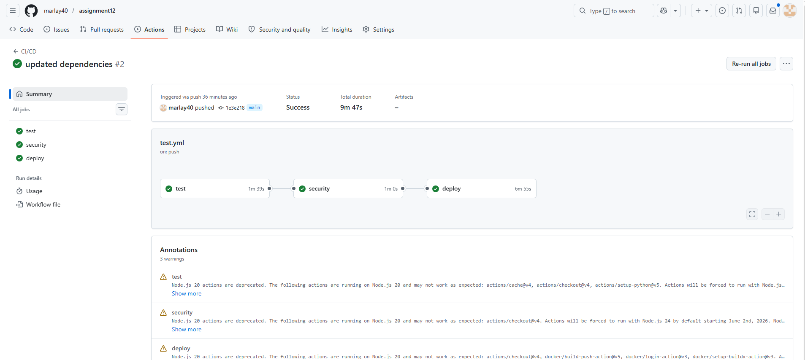
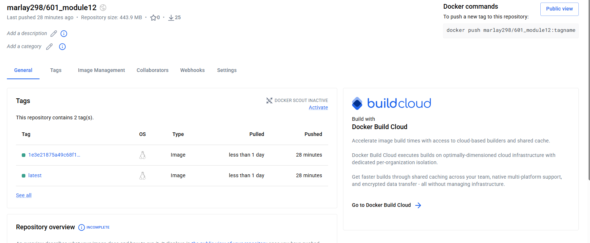

DockerHub Url: https://hub.docker.com/repository/docker/marlay298/601_module10/general

## GitHub Actions Workflow:

## DockerHub Deployment:

## How to Run Tests Locally
1. Create and activate venv  
2. Install dependencies: `pip install -r requirements.txt`  
3. Run tests: `python -m pytest`  